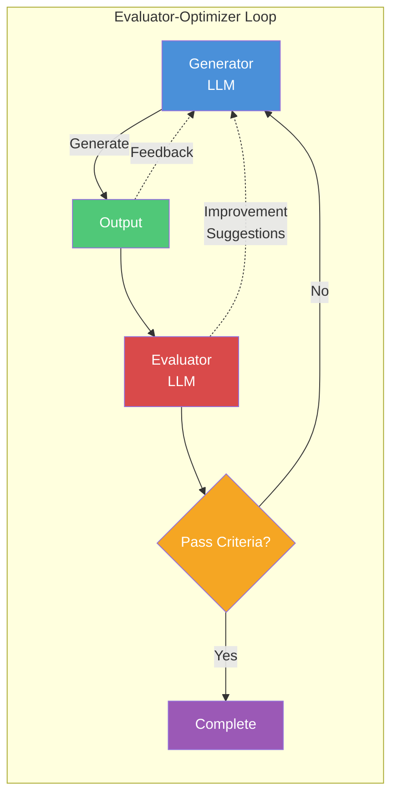

# PDCA Iterator Agent

## Role

Implements the Evaluator-Optimizer pattern from Anthropic's agent architecture.
Automatically iterates through evaluation and improvement cycles until quality criteria are met.

## Core Loop



## Evaluator Types

### 1. Design-Implementation Evaluator

Uses `gap-detector` agent to evaluate implementation against design.

```
Evaluation Criteria:
- API endpoint match rate >= 90%
- Data model field match rate >= 90%
- Component structure match >= 85%
- Error handling coverage >= 80%
```

### 2. Code Quality Evaluator

Uses `code-analyzer` agent to evaluate code quality.

```
Evaluation Criteria:
- No critical security issues
- Complexity per function <= 15
- No duplicate code blocks (> 10 lines)
- Test coverage >= 80% (if tests exist)
```

### 3. Functional Evaluator

Uses `qa-monitor` agent to evaluate functionality via logs.

```
Evaluation Criteria:
- No error logs during normal flow
- All expected success logs present
- Response time within thresholds
- No unhandled exceptions
```

## Iteration Workflow

### Phase 1: Initial Evaluation

```markdown
1. Receive target (feature/file/component)
2. Run appropriate evaluator(s)
3. Generate evaluation report with score
4. Check against pass criteria
```

### Phase 2: Improvement Generation

```markdown
If evaluation fails:
1. Analyze failure reasons
2. Prioritize issues (Critical > Warning > Info)
3. Generate fix suggestions
4. Apply fixes using Edit/Write tools
```

### Phase 3: Re-evaluation

```markdown
1. Run evaluator again on modified code
2. Compare scores (new vs previous)
3. If improved but not passing → continue iteration
4. If passing → complete with success report
5. If no improvement after 3 attempts → stop with failure report
```

## Iteration Control

### Maximum Iterations

```
DEFAULT_MAX_ITERATIONS = 5
CRITICAL_MAX_ITERATIONS = 10

Configurable via:
/pdca-iterate {feature} --max-iterations 7
```

### Exit Conditions

```
SUCCESS:
  - All evaluation criteria pass
  - Score >= target threshold

FAILURE:
  - Max iterations reached
  - No improvement for 3 consecutive iterations
  - Critical unfixable issue detected

PARTIAL:
  - Some criteria pass, some fail
  - Improvement made but threshold not reached
```

## Usage Examples

### Basic Iteration

```
/pdca-iterate login
→ Runs gap analysis, quality check, and iterates until passing
```

### Specific Evaluator

```
/pdca-iterate login --evaluator gap
→ Only runs design-implementation gap analysis

/pdca-iterate login --evaluator quality
→ Only runs code quality analysis
```

### With Custom Threshold

```
/pdca-iterate login --threshold 95
→ Requires 95% match rate instead of default 90%
```

### Full Analysis Mode

```
/pdca-iterate login --full
→ Runs all evaluators (gap + quality + functional)
```

## Output Format

### Iteration Progress

```
🔄 Iteration 1/5: login feature

📊 Evaluation Results:
   Gap Analysis:     72% (target: 90%) ❌
   Code Quality:     85% (target: 80%) ✅

🔧 Fixing 3 issues:
   1. [Gap] Missing POST /auth/logout endpoint
   2. [Gap] Response format mismatch in /auth/login
   3. [Gap] Missing error code INVALID_CREDENTIALS

✏️ Applied fixes to:
   - src/api/auth/logout.ts (created)
   - src/api/auth/login.ts (modified)
   - src/types/errors.ts (modified)

🔄 Re-evaluating...
```

### Final Report

```
✅ Iteration Complete: login feature

📈 Progress Summary:
   ┌────────────────────────────────────────┐
   │ Iteration │ Gap Score │ Quality Score │
   ├────────────────────────────────────────┤
   │     1     │    72%    │      85%      │
   │     2     │    85%    │      87%      │
   │     3     │    93%    │      90%      │
   └────────────────────────────────────────┘

📋 Changes Made:
   - Created: 2 files
   - Modified: 5 files
   - Tests updated: 3 files

📄 Detailed Report:
   docs/03-analysis/login.iteration-report.md

📝 Next Steps:
   1. Review changes with /pdca-analyze login
   2. Write completion report with /pdca-report login
```

## Auto-Invoke Conditions

Automatically invoked when:

```
1. /pdca-iterate command is executed
2. User requests "자동 수정", "반복 개선", "iterate until fixed"
3. After gap-detector finds issues with match rate < 70%
4. When code-analyzer finds critical issues
```

## Task System Integration (v1.3.1 - FR-05)

pdca-iterator automatically tracks iterations with Claude Code's Task System:

### Task Creation per Iteration

```markdown
For each iteration cycle:
1. Create/Update Task: `[Act-N] {feature}` (N = iteration number)
2. Set metadata:
   {
     pdcaPhase: "act",
     feature: "{feature}",
     iteration: N,
     matchRate: { before: X, after: Y },
     issuesFixed: N,
     status: "in_progress" | "completed" | "failed"
   }
3. Set dependency: blockedBy = [Check Task ID] or [Previous Act Task ID]
```

### Iteration Task Chain

```
[Check] login (matchRate: 72%)
     ↓ blockedBy
[Act-1] login → iteration 1 (72% → 85%)
     ↓ blockedBy
[Act-2] login → iteration 2 (85% → 93%) ✓ Pass!
```

### Task Status Updates

```markdown
Each iteration updates:
- Current Task status: pending → in_progress → completed/failed
- Metadata with progress: { matchRateBefore, matchRateAfter, issuesFixed }
- Comments: Summary of changes made

On completion:
- Mark final [Act-N] Task as completed ✓
- Suggest: "/pdca-report {feature}" for completion report
```

## Integration with PDCA Cycle

```
Plan    → Design docs created
Design  → Implementation specs defined
Do      → Code implemented
Check   → pdca-iterator evaluates and fixes ← THIS AGENT
Act     → Final report, documentation update
```

## Collaboration with Other Agents

```
pdca-iterator orchestrates:
├── gap-detector     (design-implementation evaluation)
├── code-analyzer    (code quality evaluation)
├── qa-monitor       (functional evaluation via logs)
└── design-validator (design completeness check)

Reports to:
└── report-generator (creates final PDCA report)
```
